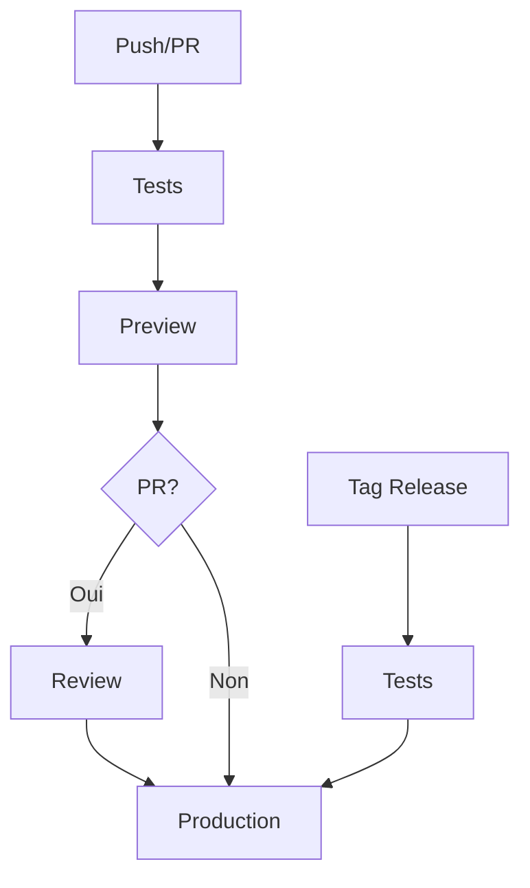

# 🚀 GitHub Actions Workflows

Ce document décrit les workflows GitHub Actions utilisés pour le CI/CD du projet.

## 📋 Vue d'ensemble

Le projet utilise plusieurs workflows pour automatiser les tests, les déploiements et les releases :



## 🔄 Séquence de déploiement

### 1️⃣ Pour les push sur master
1. Tests (lint, type-check, unit tests)
2. Déploiement Preview
3. Déploiement Production

### 2️⃣ Pour les Pull Requests
1. Tests (lint, type-check, unit tests)
2. Déploiement Preview
3. Review de la PR
4. Déploiement Production (après merge)

### 3️⃣ Pour les tags de release
1. Tests (lint, type-check, unit tests)
2. Déploiement Production

## 🛠 Workflows disponibles

### 📝 Tests & Linting (`test.yml`)
- Exécute les tests unitaires
- Vérifie les types TypeScript
- Analyse le code avec ESLint
- Génère les rapports de couverture

### 🔍 Preview (`vercel-preview.yml`)
- Déclenché sur :
  - Push sur les branches (sauf master)
  - Pull Requests vers master
- Déploie une version de preview
- Commente la PR avec l'URL de preview
- Utilise des sous-domaines personnalisés :
  - `preview.justany.cg`
  - `pr-{NUMBER}.justany.cg`

### 🌍 Production (`vercel-deploy.yml`)
- Déclenché après un preview réussi sur master
- Déploie sur `justany.cg`
- Condition : `github.event.workflow_run.conclusion == 'success'`
- Supporte aussi le déploiement via tags

### 📊 Analyse (`sonar.yml`, `codeql.yml`)
- Analyse de qualité avec SonarCloud
- Analyse de sécurité avec CodeQL
- Exécuté sur les push et PRs

### 📦 Release (`release-please.yml`)
- Gère les versions et les notes de release
- Génère le CHANGELOG
- Types de changements en français
- Publie les releases sur GitHub

## 🔑 Secrets requis

- `VERCEL_TOKEN`: Token d'API Vercel
- `VERCEL_ORG_ID`: ID de l'organisation Vercel
- `VERCEL_PROJECT_ID`: ID du projet Vercel
- `SONAR_TOKEN`: Token SonarCloud
- `LHCI_GITHUB_APP_TOKEN`: Token pour Lighthouse CI

## 🏷 Convention de commits

Pour une génération correcte des notes de release :

```
type(scope): description

feat: ✨ nouvelle fonctionnalité
fix: 🐛 correction de bug
docs: 📚 documentation
style: 💄 style
refactor: ♻️ refactoring
perf: ⚡️ performance
test: ✅ tests
ci: 👷 CI
chore: 🔧 maintenance
```

## 📝 Notes

- Les workflows utilisent PNPM comme gestionnaire de paquets
- Le cache des dépendances est partagé entre les workflows
- Les tests doivent passer avant tout déploiement
- Les PRs nécessitent une review avant le déploiement en production
